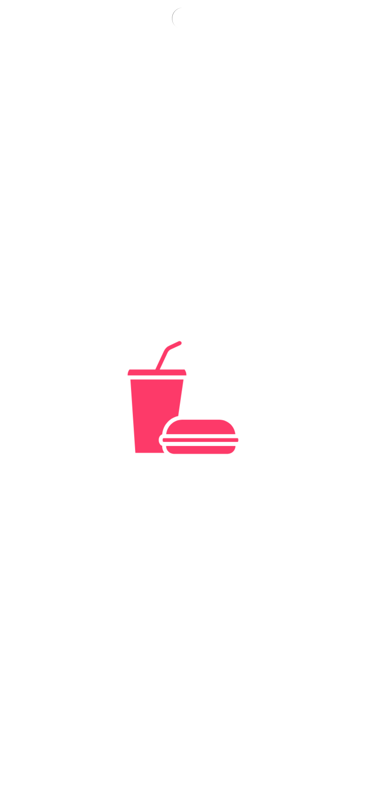
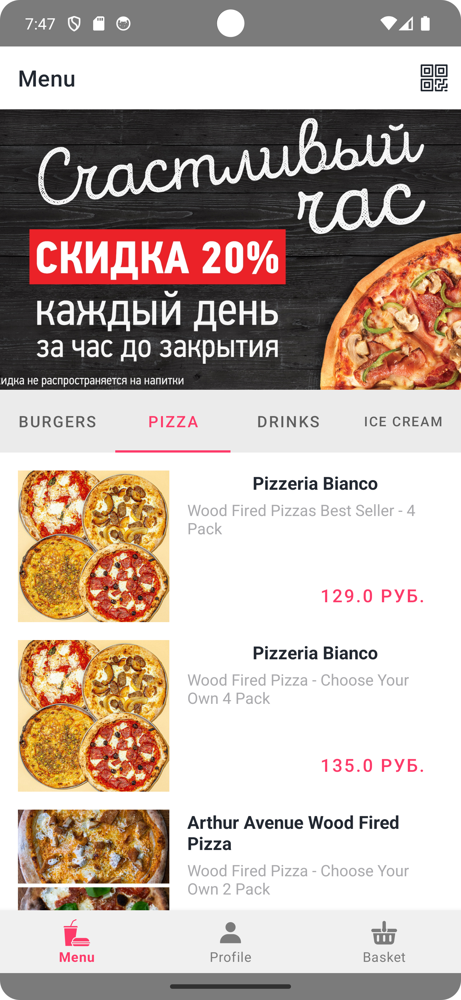
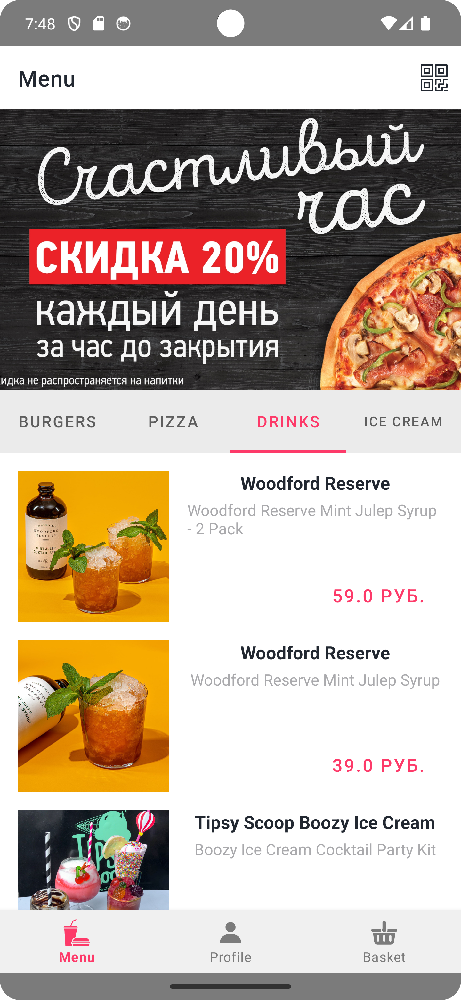
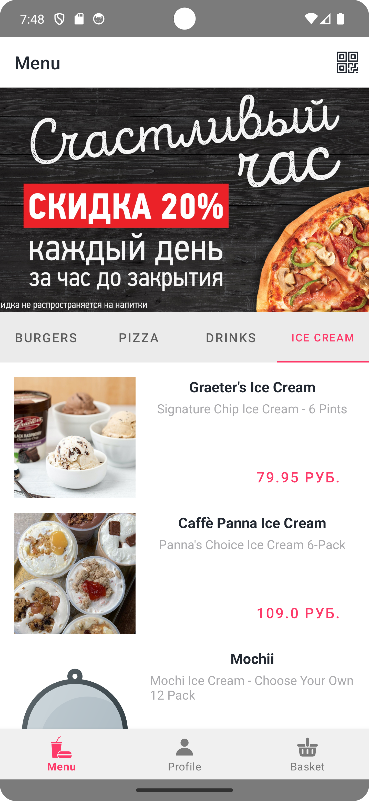
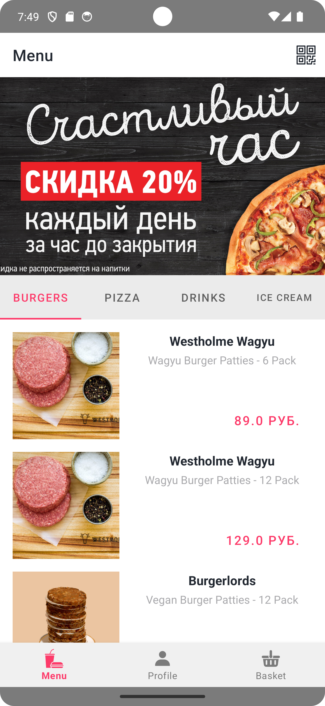
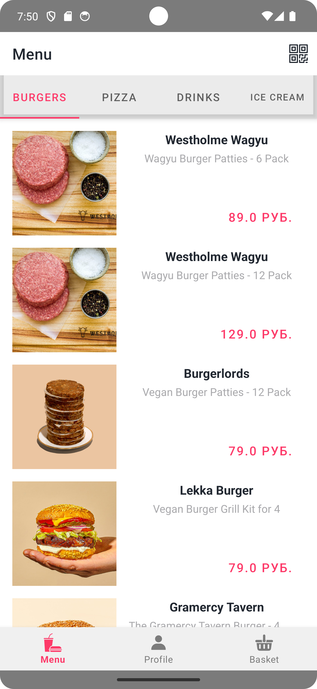

## Menu

            

            

- Использован открытый API https://adorable-bat-fatigues.cyclic.app/
- Создана база данных Room, запрос списков для демонстрации из БД
- Архитектура MVVM
- Библиотеки Room, Coroutines, Recyclerview, Hilt, GSON, Glide
- Прокрутка рекламного баннера с помощью CollapsingToolbar
